
# De stad was van ons

### Table of Contents
- [Artefact](#artefact)
  * [Metadata](#metadata)
- [Research](#research)
  * [Brief history about the squatters movement in Amsterdam](#brief-history-about-the-squatters-movement-in-amsterdam)
  * [Neigbourhoods in Amsterdam today](#neigbourhoods-in-amsterdam-today)
  * [Content of cassettes](#content-of-cassettes)
  * [Concept](#concept)
  * [Research question](#research-question)
- [Transcoding](#transcoding)
  * [1. Audio snippets from cassettes content](#1-audio-snippets-from-cassettes-content)
  * [2. Mapping squatters buildings then vs now](#2-mapping-squatters-buildings-then-vs-now)
  * [3. Mapping trendy new coffeeplaces](#3-mapping-trendy-new-coffeeplaces)
  * [4. Small poems created from cassettes](#4-small-poems-created-from-cassettes)
- [Reflection](#reflection)
- [Outcomes](#outcomes)
    + [Outcome Links](#outcome-links)
- [Conclusion](#conclusion)

# Artefact
Cassettes containing interviews with 28 ex-squatters in Amsterdam, recorded in 1996 with a total length of 19 hrs 31 min. The concerened interviews are about the experience of squatting spanned over several years.

[Research](#Research-h1)

## Metadata
| Tag | Data |  
|--|--|
**IISG Call Number** | [IISG BG GC10/963-993](https://search.iisg.amsterdam/Record/1295445)
| **Physical Description** | De stad was van ons 
| **Type** | Object
| **Medium** | Audiotapes
| **Materials** | Cassette
| **Date** | 1996
|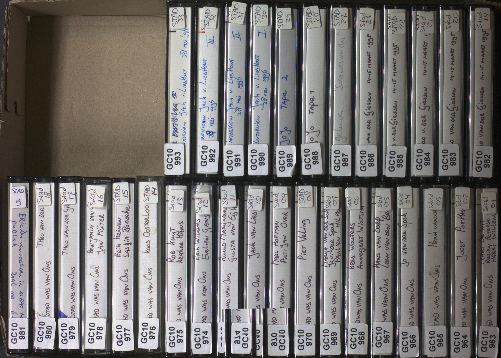| Paperbox with 31 cassette tapes, containing 28 intervieuws with ex-squatters (stored in the archive in this way). Every cassette is named (with the name of the concerned interviewee) and numbered. Some cassettes contain half of the interview, the remaining part is then on the following cassette. The covers of the cassettes don't contain an image. 

# Research
## Amsterdam back then
Squatting in Amsterdam refers to the occupation of unused or derelict buildings or land without the permission of the owner. The modern squatters movement (Dutch: kraakbeweging) began in the 1960s in the Netherlands and became a powerful housing movement in the 1980s.[[1]](#footnote-1) At its height the squatters movement regularly came into conflict with the state, particularly in Amsterdam.[[2]](#footnote-2)

Renewal comes from fringes, the squatters movement gave a lot to Amsterdam as a city. The cultural freedom gave space for creative interpretation that created multiple chances for the city.

## Amsterdam today
Amsterdam is an uplifting city with a good economy partly based on tourism income. After de economy crisis and then buildup, it's stable and uprising.[[3]](#footnote-3) Houses are hardly affordable right now and the structure of the city is changed.[[4]](#footnote-4)

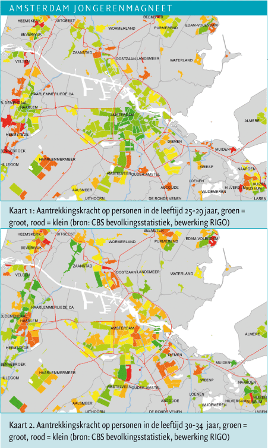
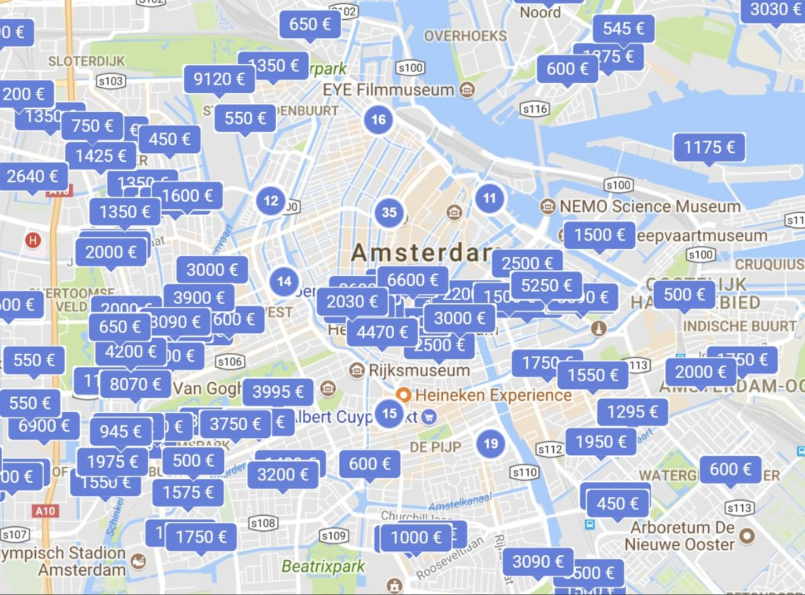
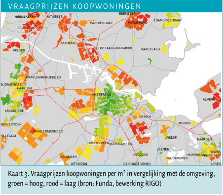
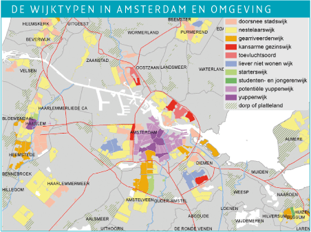

## Content of cassettes
The cassestted contain interviews, that are structured with question > awnser and all the side roads that are created from there. The content is based on the experience of the interviewee/ex-squatter but mostly about the whole squatting experience, from the moment they first acquainted with the sqautters movement until they left. 

### Common questions asked during the interviews
- Why the squattersmovement?
- What attracted you?
- When and how did you become aware?
- What was your political motive?
- How did get into the squatters movement?

## Concept
Tangible/interactive installation that conveys the feeling of the content of the tapes reflected on Amsterdam in 2020. What is the contemporary interpretation of the tapes? What did the squatters look like? How did it smell on the street? What elements in the city are left from that time?
Visualizing a map of the city with different elements transcoded from the 28 audio tapes.

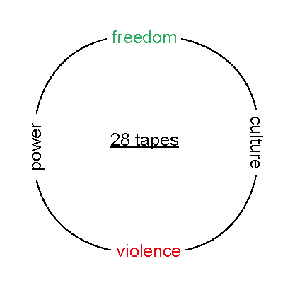
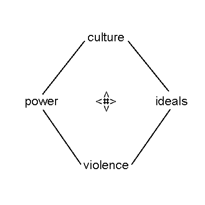 

*De stad is van ons 
De stad was van ons 
De stad weer van ons 
Van wie is de stad?*

## Research question
What happend to Amsterdam in the time from the squatters movement around 1980 and right now in 2020?  What are the area's around the squattersplaces (mentioned in the tapes) like right now? What aspects do we, nowadays, experience from what is left from the squatters movement? And how do we, right now, experience the city?

# Transcoding
With the total length of the cassettes there is a lot of material to transcode. I'll dive deeper into organizing the audio in smaller snippets that refer to different parts of the content of the cassettes. Next to that I mapped the content of the tapes and translated that into present sence, with details from back then collected from the tapes and translated into the Amsterdam as I know it today. 

## 1. Audio snippets from cassettes content
I went through the cassettes to reconize a rythm and structure in the interviews. There are certain questions asked and different return topics come across. In the audio there is also a lot of noise and other unplaceble sounds. I made audio snippets from different sounds/perspectives. 

### Aims
Doing this is a way to get to know the full content of the cassettes and at the same time searching for a rythm. Making the snippets will give a 'trailer' effect for the listener, a first 'get to know' without having to listen to the full length of the audio.

### Methods
All the audio of the cassettes is on [here]([http://www.iisg.nl/staatsarchief/audiocollecties/destad.php#interviews](http://www.iisg.nl/staatsarchief/audiocollecties/destad.php#interviews)) the website of the IISG linked to staatsarchief. You are able to download them. First I listened to a couple of them now and then and after that one by one. 
- Play, pause, play, pause, play, stop
- Detecting questions & answers
- Cutting up the audio files
- Combining pieces together

### Results
| Questions | Answers |  
|--|--|
| Why squattersmovement? | To Amsterdam for study, tired of studying
| What attracted you? | Go against the grain
| Awareness | Tv, the news, radio
| political motive | Go against the grain and what I learned from home
| Entrance squattersmovement | 1980
| Where did you live? | Rivierenbuurt

audiofiles

### Source Links
[Tate - Audio Arts](https://www.tate.org.uk/about-us/projects/audio-arts)

## 2. Mapping squatters buildings then vs now
In the audio files of the cassettes the interviewee/ex-squatters talk about where the were living in Amsterdam when the entered the squatters movement. I collected the addresses of those squatters buildings and looked them up. Where are they now? are they still here?

### Aims
Amsterdam housing changed a lot over the years and nearly all the squatting places are illegal/gone. To take a closer look to the original places and the change of the neighbourhood I get a good overview of what changed in approximately 40 years. 

### Methods
Getting the exact location fromt the audio files and then using google maps to look it up. With streetview have a little round in the neighbourhoor and check what is happing there while screenrecording it. 

### Results
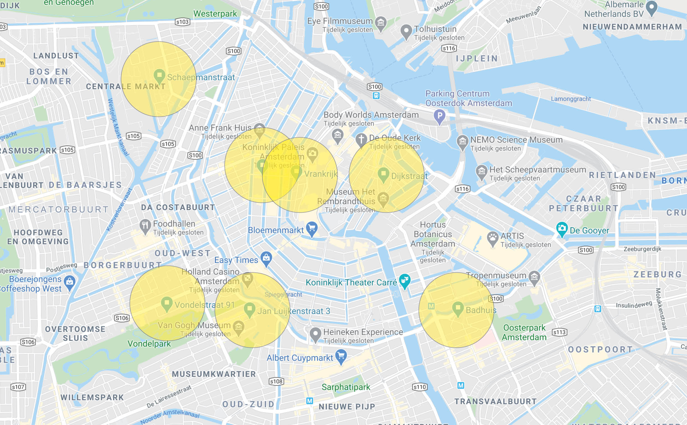

### Source Links
[Google Street View Hyperlapse](https://vimeo.com/63653873)

[Postcards from Google Maps](http://www.postcards-from-google-earth.com/)

## 3. Mapping trendy new coffeeplaces 
After the economic crisis that had taken place before the squatters 'movement and after the clearing of the squatters' houses, economic growth eventually emerged and gentrification took place. People from outside the cities moved to Amsterdam and a new people slowly took over: 'yuppen'. Hip coffeebars appeared one by one and then in bushes. How many are there actually in Amsterdam? and where are they?

### Aims
By mapping a typical example of gentrification in Amsterdam it will give a contradictory view of what was happening, especially economically, after the cleaning of the squatters houses. To show a now a day view of the city. 

### Methods
By searching on blogs and biking through Amsterdam I made a collection of trendy coffeebars that I pinned in google maps. On google streetview I made screenshots of the facades of the places and collected tripadvisor reviews about 'yuppen'.

### Results
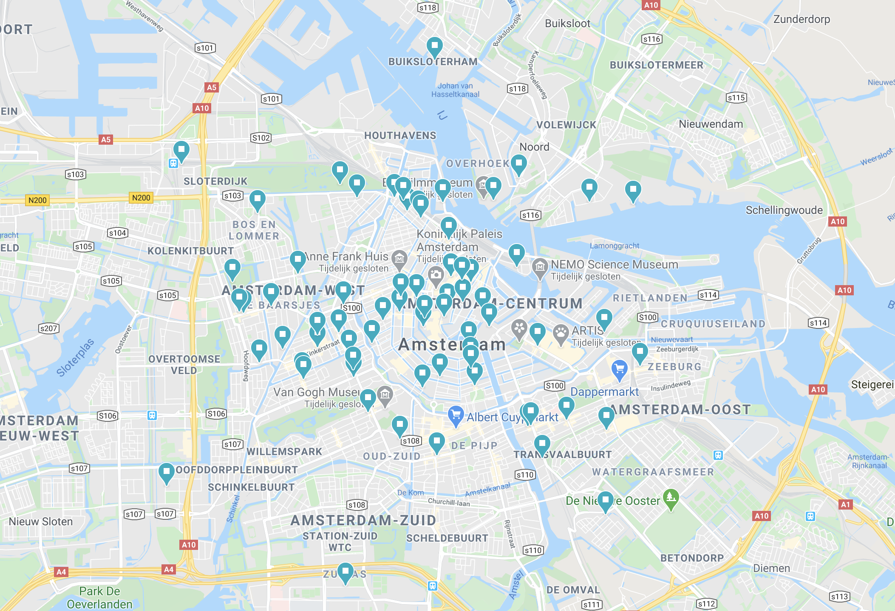

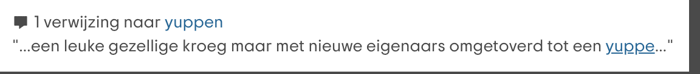

### Source Links
[Satellite Collections, Jenny Odell](http://www.jennyodell.com/satellite.html)

[Subjective Atlas](http://subjectiveatlas.info/)

[De open kaart van Amsterda, Jan Rothuizen](https://janrothuizen.nl/portfolio/de-open-kaart-van-amsterdam-3/)

## 4. Small poems created from cassettes 
While listening to the interviews I feel a lot of emotion, about the whole proces of the sqautters and what they have been through. A strong feeling of power and wanting things to change.  Discribed in words nearly becomes poetry.

### Aims
Walking on the streets, listening to poetry, can make you transport to another time inside the emotion of a different situation. I want to create this to combine the emotion/situation of the ex-squatters with the current one in Amsterdam. [[5]](#footnote-5)

### Methods
Together with my current view on the housing situation in Amsterdam, the things being said in the interviews and the view on the future I would write small poems about the situation. By collecting different bits and pieces and complement them.

### Results

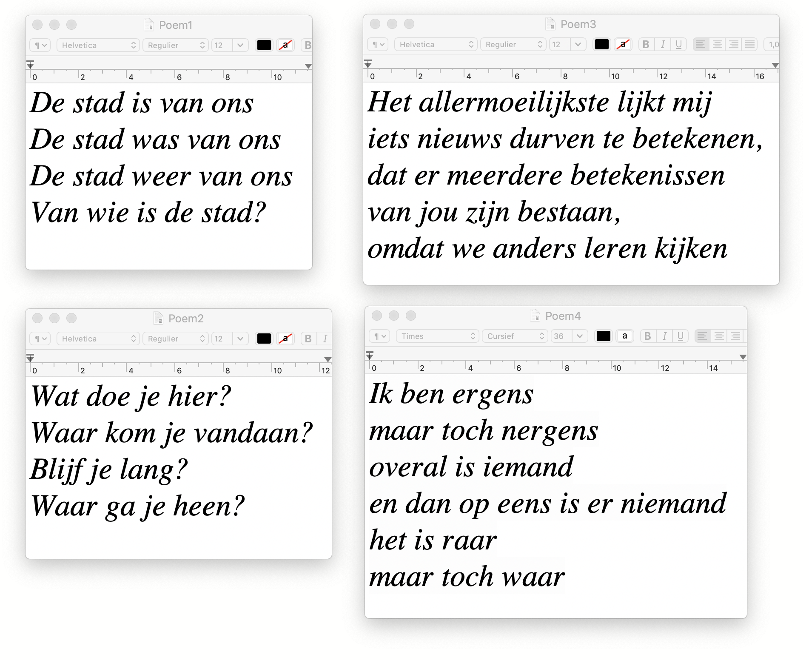

### Source Links
[Google maps poetry](https://www.google.com/maps/d/u/0/viewer?msa=0&ll=51.696674000000044%2C-2.6769950000000335&spn=6.989994%2C19.753418&mid=1YoESxxGO4b0u3qcT5UlhKNIOOTE&z=8)

[Introducing poetry map](http://thewritingplatform.com/2018/05/introducing-poetry-map/)

[Digital art meets poetry](https://www.dazeddigital.com/artsandculture/article/19735/1/digital-art-meets-poetry-in-this-google-maps-mash-up)

 
# Reflection

# Outcomes
### Possible outcomes
Using different types of mapping together in 1 system, to combine the experience from the ex-squatters with the experience now. All of the transcodings can come together as an screen-based experience.
- Mapping website
- Walking route on google maps
- Audio tour (with pieces of tapes)
- Written poems
- Augmented reality objects

[Urban Data](https://www.ams-institute.org/urban-data/)

[API's voor geolocatie | Google Maps Platform | Google Cloud](https://cloud.google.com/maps-platform/?hl=nl&utm_source=google&utm_medium=cpc&utm_campaign=FY18-Q2-global-demandgen-paidsearchonnetworkhouseads-cs-maps_contactsal_saf&utm_content=text-ad-none-none-DEV_c-CRE_417765871570-ADGP_Hybrid+%7C+AW+SEM+%7C+SKWS+~+Maps+%7C+BMM+%7C+Mapping+APIs-KWID_43700051585816041-kwd-412104684431-userloc_9063510&utm_term=KW_%2Bmap%20%2Bapis-ST_%2Bmap+%2Bapis&gclid=EAIaIQobChMI6pa9xYn36AIVj6Z3Ch30KwnQEAAYASAAEgL4evD_BwE)

### References
[Create your Mobile Audio Tour Guide App](https://www.actiondatasystems.com/)

[Styling Wizard: Google Maps APIs](https://mapstyle.withgoogle.com/)

[Create Your Own Audio Tour " VoiceMap](https://voicemap.me/create-audio-tours)

### Outcome Links
Links outcome

# Conclusion 

## Bibliography
<a name="footnote-1">**[1]**</a>: https://nl.wikipedia.org/wiki/Rellen_en_opstanden_in_Amsterdam#Krakersrellen

<a name="footnote-2">**[2]**</a>: http://www.iisg.nl/staatsarchief/publicaties/voettussendedeur/hoofdstuk03.php

<a name="footnote-3">**[3]**</a>: https://www.parool.nl/columns-opinie/de-yup-neemt-amsterdam-over~bf45797d/

<a name="footnote-4">**[4]**</a>: https://www.at5.nl/artikelen/172800/amsterdam-weer-van-ons-kinkerbuurt-voert-actie

<a name="footnote-5">**[5]**</a>: https://www.groene.nl/artikel/amsterdam-noord

